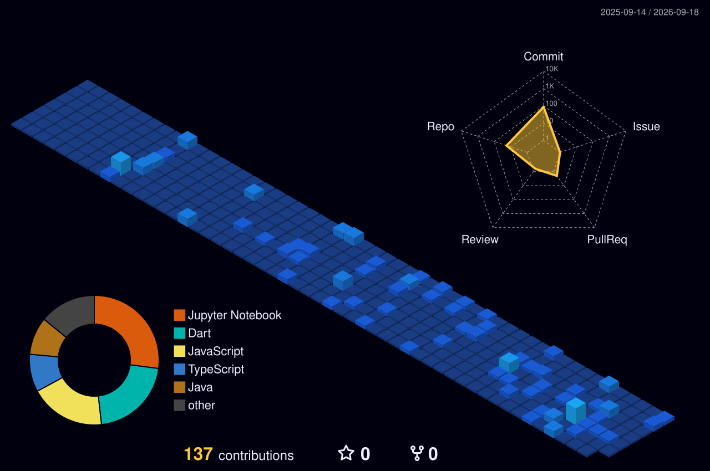

<table style="border: none;">
  PERSONAL ID CARD
  <tr>
    <td width="40%">
<pre>

</pre>
    </td>
    <td width="60%">
<pre>
aldino@ambatronz
-----------------
OS: ........... Windows 11, Android 14, Debian GNU/Linux (Terminal-only)
Role: ......... Game, Web, & Mobile Developer
Campus: ....... Politeknik Elektronika Negeri Surabaya
Languages: .... Java, Python, C#, Dart, TypeScript, GDScript
Hobbies: ...... Drawing, Gaming, Reading Philosophy
Contact: ...... aldinomaytatap@gmail.com
Location: ..... Surabaya, Indonesia

GitHub Stats
-----------------
Commits: ...... apaya
Focus: ........ Building immersive games and scalable apps
</pre>
    </td>
  </tr>
</table>

# 👋 Hi there, I'm Aldino Maytata Prandila

  
  

  
  
  
  

---

## 🎓 Education

### 🏛️ Politeknik Elektronika Negeri Surabaya (PENS)
**Bachelor of Informatics Engineering** | GPA: **3.76/4.00**

*Focusing on Software Development, Game Development, and Mobile Applications*

---

## 🛠️ Tech Stack

### 💻 Languages

### 🎮 Game Development

### 📱 Mobile Development

### 🎨 Frontend

### ⚙️ Backend

### 🗄️ Databases

### 🔧 Tools & Others

---

## 📊 GitHub Stats

  
  
  
  
  
  

---

## 🏆 GitHub Trophies

  
  

---

## 📈 Contribution Graph

  

---

## 🎯 Featured Projects

  <table style="border: none; background-color: transparent;">
    <tr>
      <td align="center" width="50%">
        <a href="https://github.com/AmbatronZ/Renovasim-Flutter">
          <!-- Menggunakan Socialify untuk banner dinamis bergaya tech -->
          
        </a>
         
        <b>📱 Renovasim Flutter</b>
      </td>
      <td align="center" width="50%">
        
         
        <b>💻 Trapezibuddy</b>
      </td>
    </tr>
  </table>

---

## 💼 What I'm Working On

- 🎮 Developing immersive gaming experiences with Unity, Godot, RPG Maker XP, Scratch And Unreal Engine
- 📱 Building cross-platform mobile applications with Flutter
- 🌐 Creating responsive and dynamic web applications
- 🚀 Exploring new technologies and expanding my skillset
- 📚 Contributing to open-source projects

---

## 💡 Random Dev Quote

  
  

---

## 📫 Let's Connect!

I'm always open to interesting conversations and collaboration opportunities!

💬 Ask me about **Game Development, Web Development, Mobile Development, or Tech in general**

📧 Reach out: **aldinomaytatap@gmail.com**

🌐 My Biography : **[Biography Website](https://141000329513.it.student.pens.ac.id/)**

🎓 Currently studying at **Politeknik Elektronika Negeri Surabaya**

---

## ⚡ Recent Activity
<!--START_SECTION:activity-->
1. ❗ Opened issue [#1](https://github.com/AmbatronZ/AmbatronZ/issues/1) in [AmbatronZ/AmbatronZ](https://github.com/AmbatronZ/AmbatronZ)
<!--END_SECTION:activity-->

---
  
  
  
  ### Show some ❤️ by starring some of my repositories!
  
  *"Perburuan gelar karena panggilan untuk memahami cosmos atau hanya untuk tuntutan status sosial? ."*  By Myself

